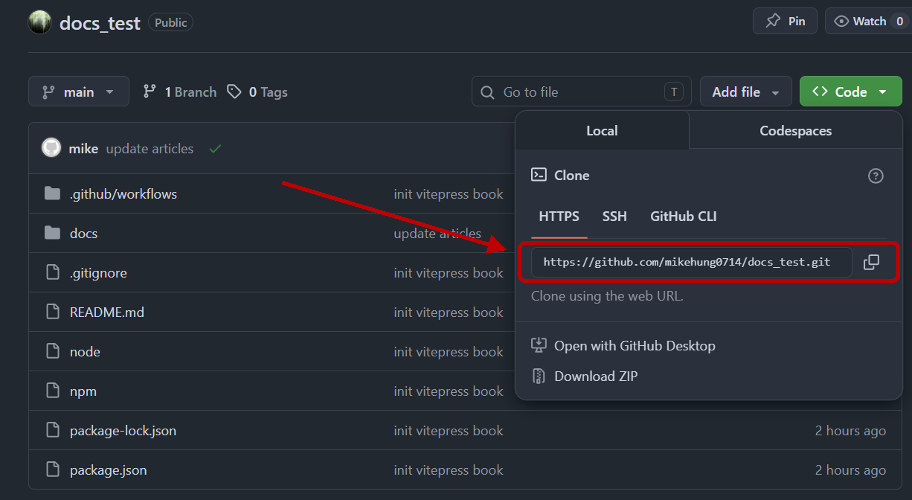

# push 到 GitHub

## 第一次 push 到自己的 GitHub
先在 GitHub 建立一個 repository


- Repository name：都可以
- Description：可以不用填
- Choose visibility：必須選 `Public`，除非你有付費
- Add .gitignore：選 `No .gitignore`
- Add license：選 `license`

回到 VSCode 打開 `docs/.vitepress/config.mts` 
找到(第9行)：

```ts
base: '/docs_test/'
```

如果你的 repo 叫：

```text
my-blog
```

就改成：

```ts
base: '/my-blog/'
```

接著到 GitHub 專案頁面
```ts
Settings → Pages
```
Source 選：
```ts
GitHub Actions
```

複製 repo 網址


在 VSCode 終端機輸入
```bash
git remote add origin https://github.com/你的帳號/my-blog.git
git branch -M main
git add .
git commit -m "init"
git push -u origin main
```

回到 Pages 頁面，看到上方出現網址就成功了。

---

## 上傳更新到 GitHub
每次修改完文章、圖片或設定後，都要 push 到 GitHub。
在 VSCode 終端機輸入：

```bash
git add .
git commit -m "update"
git push
```
完成後 GitHub Pages 會自動重新部署。
大約等 1 到 2 分鐘，網站就會更新。

